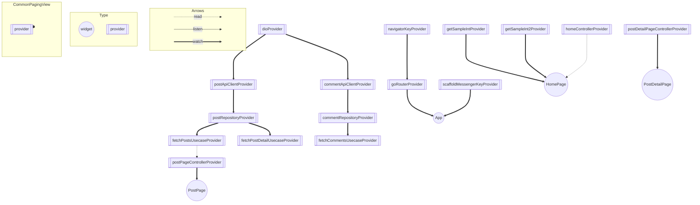

```mermaid
flowchart TB
  subgraph Arrows
    direction LR
    start1[ ] -..->|read| stop1[ ]
    style start1 height:0px;
    style stop1 height:0px;
    start2[ ] --->|listen| stop2[ ]
    style start2 height:0px;
    style stop2 height:0px;
    start3[ ] ===>|watch| stop3[ ]
    style start3 height:0px;
    style stop3 height:0px;
  end
  subgraph Type
    direction TB
    ConsumerWidget((widget));
    Provider[[provider]];
  end

  fetchPostsUsecaseProvider[["fetchPostsUsecaseProvider"]];
  postRepositoryProvider[["postRepositoryProvider"]];
  fetchPostDetailUsecaseProvider[["fetchPostDetailUsecaseProvider"]];
  fetchCommentsUsecaseProvider[["fetchCommentsUsecaseProvider"]];
  commentRepositoryProvider[["commentRepositoryProvider"]];
  postApiClientProvider[["postApiClientProvider"]];
  commentApiClientProvider[["commentApiClientProvider"]];
  dioProvider[["dioProvider"]];
  goRouterProvider[["goRouterProvider"]];
  scaffoldMessengerKeyProvider[["scaffoldMessengerKeyProvider"]];
  getSampleIntProvider[["getSampleIntProvider"]];
  getSampleInt2Provider[["getSampleInt2Provider"]];
  homeControllerProvider[["homeControllerProvider"]];
  subgraph CommonPagingView
    CommonPagingView.provider[["provider"]];
  end
  postPageControllerProvider[["postPageControllerProvider"]];
  postDetailPageControllerProvider[["postDetailPageControllerProvider"]];
  navigatorKeyProvider[["navigatorKeyProvider"]];
  App((App));
  HomePage((HomePage));
  CommonPagingView((CommonPagingView));
  PostPage((PostPage));
  PostDetailPage((PostDetailPage));

  goRouterProvider ==> App;
  scaffoldMessengerKeyProvider ==> App;
  getSampleIntProvider ==> HomePage;
  getSampleInt2Provider ==> HomePage;
  homeControllerProvider -.-> HomePage;
  CommonPagingView.provider ==> CommonPagingView;
  CommonPagingView.provider --> CommonPagingView;
  CommonPagingView.provider -.-> CommonPagingView;
  CommonPagingView.provider -.-> CommonPagingView;
  postPageControllerProvider ==> PostPage;
  postDetailPageControllerProvider ==> PostDetailPage;
  postRepositoryProvider ==> fetchPostsUsecaseProvider;
  postApiClientProvider ==> postRepositoryProvider;
  postRepositoryProvider ==> fetchPostDetailUsecaseProvider;
  commentRepositoryProvider ==> fetchCommentsUsecaseProvider;
  commentApiClientProvider ==> commentRepositoryProvider;
  dioProvider ==> postApiClientProvider;
  dioProvider ==> commentApiClientProvider;
  navigatorKeyProvider ==> goRouterProvider;
  fetchPostsUsecaseProvider -.-> postPageControllerProvider;
```
